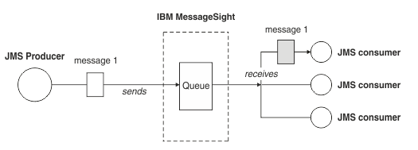

# Blues

## Task
Develop a WebSockets (browser based) client that requests an asynchronous reply from a message queue that
fans out to at least 2 possible solution services. Eg. the browser contacts the 'Name the first pasta dish
that comes to mind' queue which fans out to the 'Julia' and 'Robert' services who each answer back after a
random delay with some random message like 'Spaghetti alle Vongele' and 'Tagliatelle al ragù'. Persist the
messages and any data you see fit in a database of your choice. **Present the response & the source of the
response in the Client**.

## My Idea
A football match simulator. Client would establish a Websockets connection with a message queue that fans out
to two services—Chelsea and Juventus. Each service will post messages describing match events – goals,
bookings, substitutions - to the message queue. The Chelsea service will post Chelsea-specific events, and
Juventus service would work likewise. Each event will be persisted in a database, and displayed by the client
along with the source of the message.

## Moving Parts
1. A website (the client)
2. A message queue server
3. Services that feed the message queue
4. A database

## Things I'll need to research
- Websockets

### Message Queues
Message queues enable programs to communicate with one another using a consistent API. *Messaging* means that 
programs communicate by sending each other data in messages rather than calling each other directly. *Queuing* 
means that messages are placed on queues in storage, allowing programs to run independently of each other without 
having a direct connection between them. Message queues allow for event-driven and prioritised communication, 
rather than polling and the likes.

Without queuing, sending data over long distances would require every node along the way to be online and 
available for forwarding the message, and the destination would need to be online too and awaiting a message 
delivery. So if any node in the chain goes down, the whole system crawls to a halt.

Email uses message queuing extensively. Message Queues can be thought of as email for programs.

A message queue is a named destination to which a message can be sent. It accumulates the messages which can 
then be retrieved by programs later on for processing. Queue reside in, and are managed by, a queue manager. 
RabbitMQ and ZeroMQ both are examples of queue managers.

#### Point-to-point

 
Source: <a href="https://www.ibm.com/support/knowledgecenter/en/SSCGGQ_1.2.0/com.ibm.ism.doc/Overview/ov20000.html">IBM Knowledge Center</a>

One message is placed on the queue and **one application** receives that message. The 
sending application must know information about the receiving application before it can send a message.

*Producers* send messages to the queue, and *consumers* receive messages from that queue. There can be multiple
producers writing to the queue, and multiple consumers accessing the queue. **However, any message on the queue
can be received by only one consumer**.

[IBM](https://www.ibm.com/support/knowledgecenter/en/SSCGGQ_1.2.0/com.ibm.ism.doc/Overview/ov20000.html) recommends using point-to-point messaging when you want to ensure that a message is received by only one
consumer application.

#### Publish/subscribe

 
Source: <a href="https://aws.amazon.com/pub-sub-messaging/">AWS Knowledge Center</a>

A copy of each message published by a publishing application is delivered to **every 
interested application**, called a subscriber. Messages are queued on a queue identified by a subscription.
PubSub allows you to decouple the producer from the consumers of data. The sending application do not ned to 
know as much about each other for data to be sent and received.

The provider of information is called the *publisher*. The messages they generate
are called *publications*. Publishers supply information about a subject without caring much for the applications
that are interested in that information.

The consumer of information is called a *subscriber*. Subscribers create *subscriptions* that describe the 
subject that the subscriber is interested in. The subcription determines which messages are forwarded to the
subscriber. A subscriber can make multiple subscriptions and receive information from multiple publishers.

The subject of the message information is called its *topic*. The publisher sets the topic at the time of 
publication. A subscriber is sent information about only those topics it subscribes to.

Learn more at [IBM Knowledge Center](https://www.ibm.com/support/knowledgecenter/SSFKSJ_9.0.0/com.ibm.mq.pro.doc/q004870_.htm).

### RabbitMQ

## Architectural Questions

### Which messaging paradigm to implement: point-to-point messaging or PubSub?

### Which queue manager to use: RabbitMQ or ZeroMQ?

### How to model application data? Which database to use?

## Development Plan

1.  Write a website that mocks up responses from a message queue. This would allow me to test the website in isolation.
2.  Implement a message queue server, and fill it with random messages. Again, this way we can test the MQ in isolation.
3.  Now connect the website with MQ.
4.  Write services that feed the message queue.
5.  Connect services and MQ together.
6.  Test the whole chain.
7.  Release.
8.  Party.
