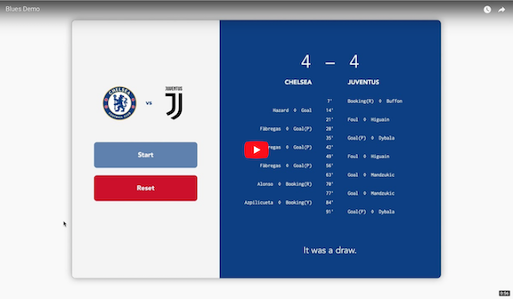
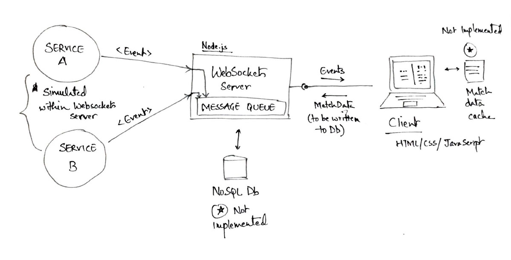

# Blues

## Task
Develop a WebSockets (browser based) client that requests an asynchronous reply from a message queue that
fans out to at least 2 possible solution services. Eg. the browser contacts the 'Name the first pasta dish
that comes to mind' queue which fans out to the 'Julia' and 'Robert' services who each answer back after a
random delay with some random message like 'Spaghetti alle Vongele' and 'Tagliatelle al ragù'. Persist the
messages and any data you see fit in a database of your choice. **Present the response & the source of the
response in the Client**.

## My Idea
A football match simulator. Client would establish a Websockets connection with a message queue that fans out
to two services—Chelsea and Juventus. Each service will post messages describing match events – goals,
bookings, substitutions - to the message queue. The Chelsea service will post Chelsea-specific events, and
Juventus service would work likewise. Each event will be persisted in a database, and displayed by the client
along with the source of the message.

## Demo
[](https://youtu.be/YHRmSLJRboU)

## Moving Parts
✔ A website (the client)  <br/>
✔ A message queue server  <br/>
✔ Services that feed the message queue  <br/>
× A database

## Things I had to learn
### Websockets
Lower level protocols such as TCP are designed to deliver one message from one sender to one receiver. They
have no opinion on how the message should be structured, requested, retrieved, secured or stored. They are
merely pipes allowing flow of data across a network.

Protocols like WebSockets (and HTTP) sit on top of TCP and add additional functionality, such as headers to
transport metadata, packets managements, basic authentication etc. WebSockets allow you to send message to a
server and receive event-driven responses without having to poll the server for a reply.

More on [Mozilla Developer Network](https://developer.mozilla.org/en-US/docs/Web/API/WebSockets_API).

### Message Queues
Message queues enable programs to communicate with one another using a consistent API. *Messaging* means that 
programs communicate by sending each other data in messages rather than calling each other directly. *Queuing* 
means that messages are placed on queues in storage, allowing programs to run independently of each other without 
having a direct connection between them. Message queues allow for event-driven and prioritised communication, 
rather than polling and the likes.

Without queuing, sending data over long distances would require every node along the way to be online and 
available for forwarding the message, and the destination would need to be online too and awaiting a message 
delivery. So if any node in the chain goes down, the whole system crawls to a halt.

Email uses message queuing extensively. Message Queues can be thought of as email for programs.

A message queue is a named destination to which a message can be sent. It accumulates the messages which can 
then be retrieved by programs later on for processing. Queue reside in, and are managed by, a queue manager. 
RabbitMQ and ZeroMQ both are examples of queue managers.

#### Point-to-point

<br/>
Source: <a href="https://www.ibm.com/support/knowledgecenter/en/SSCGGQ_1.2.0/com.ibm.ism.doc/Overview/ov20000.html">IBM Knowledge Center</a>

One message is placed on the queue and **one application** receives that message. The 
sending application must know information about the receiving application before it can send a message.

*Producers* send messages to the queue, and *consumers* receive messages from that queue. There can be multiple
producers writing to the queue, and multiple consumers accessing the queue. **However, any message on the queue
can be received by only one consumer**.

[IBM](https://www.ibm.com/support/knowledgecenter/en/SSCGGQ_1.2.0/com.ibm.ism.doc/Overview/ov20000.html) recommends using point-to-point messaging when you want to ensure that a message is received by only one
consumer application.

#### Publish/subscribe

<br/>
Source: <a href="https://aws.amazon.com/pub-sub-messaging/">AWS Knowledge Center</a>

A copy of each message published by a publishing application is delivered to **every 
interested application**, called a subscriber. Messages are queued on a queue identified by a subscription.
PubSub allows you to decouple the producer from the consumers of data. The sending application do not ned to 
know as much about each other for data to be sent and received.

The provider of information is called the *publisher*. The messages they generate
are called *publications*. Publishers supply information about a subject without caring much for the applications
that are interested in that information.

The consumer of information is called a *subscriber*. Subscribers create *subscriptions* that describe the 
subject that the subscriber is interested in. The subcription determines which messages are forwarded to the
subscriber. A subscriber can make multiple subscriptions and receive information from multiple publishers.

The subject of the message information is called its *topic*. The publisher sets the topic at the time of 
publication. A subscriber is sent information about only those topics it subscribes to.

Learn more at [IBM Knowledge Center](https://www.ibm.com/support/knowledgecenter/SSFKSJ_9.0.0/com.ibm.mq.pro.doc/q004870_.htm).

### RabbitMQ and ZeroMQ
RabbitMQ is a message broker: it accepts and forwards messages. It speaks Advanced Message Queuing Protocol (AMQP)
which is an open, general-purpose protocol for messaging. Support for other protocols such as STOMP and MQTT can be
added via a plugin. It supports both point-to-point and publish/subcribe messaging.

ZeroMQ is not a central server, rather a library to be used client-side. It aims to be a faster, decentralised
alternative to AMQP. It does support both the aforementioned messaging patterns, but requires the developer to 
write a small server to support many-to-many connections. For this task, that's not much of a problem because we 
have a one-to-one or at most one-to-many (one server, many clients) scenario here.

Source: [Overview of realtime protocols](https://deepstreamhub.com/blog/an-overview-of-realtime-protocols/)

## Architectural Questions

### Which messaging paradigm to implement: point-to-point messaging or PubSub?
Since, at some point we might want multiple clients to show match data simultaneously, point-to-point's property 
that only one application receives any given message rules it out. Thus, publish/subscribe it is.

**EDIT**: I failed to properly implement a true publish/subscribe system. See [Closing Notes](#closing-notes)

### Which queue manager to use: RabbitMQ or ZeroMQ?
To be quite honest, I still don't understand ZeroMQ well. Hence, despite its bigger footprint, I'm choosing
RabbitMQ because I found the documentation far easier to understand for total beginners like me.

### How to model application data? Which database to use?
I've found that when starting out, it's best to use a NoSQL database, experiment with schemas and once the dust is
settled, switch to SQL database. I'll be doing the same here. MongoDB. 

Both services will use the following message schema:
```json
{
  "source": "Chelsea",
  "type": "Goal",
  "player": "Hazard",
  "minute": 8
}
```
`source`: Source of the message. Either of "Chelsea" or "Juventus" <br/>
`type`: Type of event. Either of `Goal`, `Goal(P)`, `Booking(Y)`, `Booking(R)`, `Foul`, `Save` <br/>
`player`: Player in action <br/>
`minute`: Minute count at which the event occurred <br/>

The front-end will cache match data until the match is over, and then write the following document to a NoSQL DB.
```json
{
  "date": "2091301203812",
  "winner": "Chelsea",
  "team1": "Chelsea",
  "team1Score": 4,
  "team2": "Juventus",
  "team2Score": 3,
  "events": {
      "team1": [...],
      "team2": [...]
  }
}
```
`date`: Match day
`winner`: team1 | draw | team2
`team1`: The home team
`team1Score`: Number of goals scored by team1
`team2`: The away team
`team2Score`: Number of goals score by away team
`events.team1`: Match events related to team1. Array of `message` instance
`events.team2`: Match events related to team2. Array of `message` instances

**EDIT**: I failed to implement data persistence layer in time. See [Closing Notes](#closing-notes)

### Which language to use?
Despite my repugnance at JavaScript, I intend to write the entire application in TypeScript/JavaScript. Node.js
is an excellent choice for protoyping (but terrible for production). Plus the JS ecosystem has very rich support
for websockets. Plus there's no viable alternative to JavaScript for front-end work, and for such a short project
it'd be good to save on context-switching costs.

## Development Plan
✔   Write a website that mocks up responses from a message queue. This would allow me to test the website in isolation. <br/>
✔   Implement a message queue server, and fill it with random messages. Again, this way we can test the MQ in isolation. <br/>
✔   Now connect the website with MQ. <br/>
✔   Write services that feed the message queue. <br/>
✔   Connect services and MQ together. <br/>
×   Test the whole chain. Couldn't integrate database in time. <br/>
×   Release. <br/>
×   Party. <br/>

## Closing Notes
### How I approached the problem
One of the first things I did after reading the assignment, was to design the UI. The process of UI design actually 
helps me take stock of all the features, and the underlying data structures, that my application will have to support. 
It also helps me build a mental model of the communication chain (frontend -> server -> services -> server -> frontend).

### Things I learned
Tons. I had never read a word on Websockets or message queues. This was my first encounter with them and aren't I
glad to have discovered them. Perhaps, in hindsight, going for a publish/subscribe model wasn't ideal for total
newbie like me. I understand the concepts fully, and I feel I'm very close to getting it right, but need a bit more
time to get comfortable with Rabbit MQ.

### Missing essentials
* No unit testing
* Can't be hosted remotely (missing configuration bits)
* Should provide a `dockerfile` to obviate the need for [pre-run setup](how-to-run-the-program).

### Third-party code
* Used the [`ws`](https://github.com/websockets/ws) library for writing a websockets server. Mozilla recommends this library. Client-side uses native `Websocket` API.
* Used [`amqplib`](http://www.squaremobius.net/amqp.node/channel_api.html) for working with RabbitMQ. RabbitMQ docs recommend this library.

Except this, I've written all the code, both client-side and server-side, myself.

### Solution Architecture


## How to run the program
### Pre-requisites
1. [Node.js 9.11.1](https://nodejs.org/en/download/current/)
2. A modern browser with [Websockets support](https://developer.mozilla.org/en-US/docs/Web/API/WebSockets_API#Browser_compatibility)
3. [RabbitMQ 3.7](https://www.rabbitmq.com/download.html)

### Steps
*I'm not familiar with Windows, so please do excuse Mac/UNIX-specific instructions in this section.*

1. **Fire up a local instance of RabbitMQ server**
    The RabbitMQ server scripts are installed into `/usr/local/sbin`. This is not automatically added to your path, 
    so you may wish to add `PATH=$PATH:/usr/local/sbin` to your `.bash_profile` or `.profile`. The server can then 
    be started with `rabbitmq-server`.

    Open Terminal (Command Prompt/PowerShell on Windows) and type the following command
    ```
    rabbitmq-server
    ```
    
    This would spin up a local RabbitMQ server. You should have the following output in your Terminal window.   
    ```
    ##  ##
    ##  ##      RabbitMQ 3.7.4. Copyright (C) 2007-2018 Pivotal Software, Inc.
    ##########  Licensed under the MPL.  See http://www.rabbitmq.com/
    ######  ##
    ##########  Logs: /usr/local/var/log/rabbitmq/rabbit@localhost.log
                    /usr/local/var/log/rabbitmq/rabbit@localhost_upgrade.log

              Starting broker...
    completed with 6 plugins.
    ```

    **Do not close the Terminal window.**

2. **Start the server**.
    Open a new Terminal window at the root of this project, switch to the `server` directory and type in the following:
    ```
    npm install
    ```
    This will install all project dependencies (including Typescript) and transpile the `.ts` files to `.js`.

    ```
    Ashs-Mac:server animesh$ npm install
    > blues-server@0.1.0 postinstall /Users/animesh/Developer/Blues/server
    > tsc
    added 71 packages in 3.644s
    ``` 
    Now our server is ready for primetime. In your Terminal window, type `npm start`. A websockets server will start
    listening at `localhost:8080`.

3. **Start the simulation**. Open `client/index.html` in your favourite browser and click the Start button.
